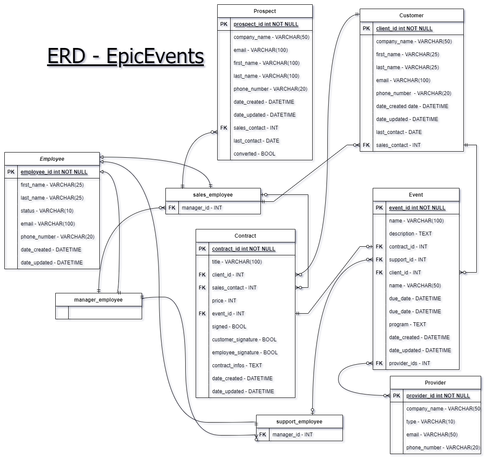
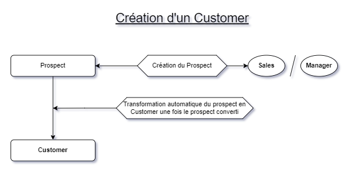
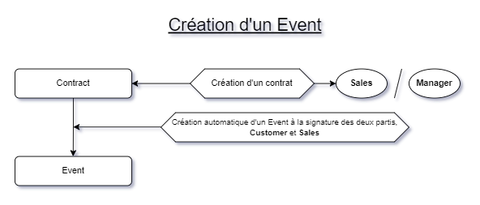

# EpicEvents CRM - Projet 12 / OC

API sécurisée réservée à la gestion client et à l'organisation d'évènement.  
La documentation Postman propre aux requêtes et à leurs réponses est présente sur ce lien : *[Documentation](https://documenter.getpostman.com/view/18501202/Uz5AqyTa)*.

&nbsp;

# 🚀 Lancement du projet

1. Tout d'abord, clonez le repository sur votre machine.  
2. Mettez en place un environnement virtuel (ex : `virtual env`)
3. Installez les dépendances avec un `pip install -r requirements.txt`
4. Lancez le serveur avec un `python manage.py runserver`
5. Connectez-vous avec le lien `/login/` en indiquant dans le body de la requête le `username` et le `password`.
6. Récupérer votre token en effectuant une requête POST avec un rappel de vos identifiants (`username:password`) à l'adresse `/obtain-token/`. 
7. Insérer votre token dans le Header,  Key : `Authorization` / Value : `token your_token` pour toutes vos prochaînes requêtes.

&nbsp;

### <ins> Identifiants de démonstration :

&nbsp;

| Username | Password | STATUS |
| ----------- | ----------- | ----- | 
| admin | password-oc | `SuperUser ( ADMIN PANNEL )`|
| jean-manage | password-oc | `MANAGER` |
| henry-support | password-oc | `SUPPORT` |
| louis-sales | password-oc | `SALES` |
| fredSNCF | password-oc | `CUSTOMER` |

&nbsp;

## <ins>Diagramme Entité-Relation : 

---

&nbsp;

## <ins>Logique métier derrière la création d'un Customer ou d'un Event :

---

&nbsp;

&nbsp;

#  <ins>Gestion de projet :

&nbsp;

###  🔐<ins>Authentification et gestion du compte :

&nbsp;

| Requête | Fonctions | Opérations CRUD |
| ----------- | ----------- | ----------- | 
| `login/` | Connexion | `POST` |
| `logout/` | Déconnexion | `GET` |
| `obtain-token/` | Renvois le token | `POST` |
| `create-employee/` | Création d'un employé (Manager uniquement) | `POST` |
| `password-update/` | Mise à jour du mot de passe | `PUT` |
| `home/account/` | Mise à jour des informations du compte | `GET`, `PUT` |
||||
||||

&nbsp;

###  📌<ins>CRM : 

&nbsp;

| Requête | Réponse | Customer | Sales | Support | Manager |
| ----------- | ----------- | ----------- | ----------- | ----------- | ----------- |
| `free-employee/` | Une liste de tous les employés sans manager ||||`GET`|
| `free-employee/<employee_id>` | Un employé sans manager ||||`GET`, `PUT`, `DELETE`|
| `employee/` | Une liste de tous les employés affiliés ||||`GET`|
| `employee/<employee_id>` | Un employé  ||||`GET`, `PUT`, `DELETE`|
| `customer/` | Une liste des clients affiliés ||`GET`|`GET`|`GET`|
| `customer/<customer_id>` | Un client ||`GET`|`GET`|`GET`, `PUT`, `DELETE`|
| `prospect/` | Une liste des prospects affiliés ||`GET`, `POST`||`GET`, `POST`|
| `prospect/<prospect_id>` | Un prospect ||`GET`, `PUT`||`GET`, `PUT`, `DELETE`|
| `free-prospect/` | Une liste des prospects non affectés ||||`GET`, `POST`|
| `free-prospect/<prospect_id>` | Un prospect non affecté ||||`GET`, `PUT`, `DELETE`|
| `provider/` | Une liste des fournisseurs ||`GET`|`GET`|`GET`, `POST`|
| `provider/<provider_id>` | Un fournisseur ||`GET`|`GET`|`GET`, `PUT`, `DELETE`|
| `contract/` | Une liste des contrats affiliés |`GET`|`GET`, `POST`|`GET`|`GET`, `POST`|
| `contract/<contract_id>` | Un contrat |`GET`, `PUT`|`GET`, `PUT`, `DELETE`|`GET`|`GET`, `PUT`, `DELETE`|
| `event/` | Une liste des évènements affiliés |`GET`|`GET`|`GET`|`GET`|
| `event/<event_id>` | Un contract |`GET`|`GET`|`GET`, `PUT`|`GET`, `PUT`, `DELETE`|
| `free-event/` | Une liste des évènements non affectés ||||`GET`|
| `free-event/<event_id>` | Un évènement non affecté ||||`GET`, `PUT`, `DELETE`|
| `account/` | Les informations de l'utilisateur connecté |`GET`, `PUT`|`GET`, `PUT`|`GET`, `PUT`|`GET`, `PUT`|
||||
||||

> Tous les points d'entrée précèdant suppose en racine l'adresse `http://localhost:8000/home/`.

&nbsp;

##  🗃️<ins>Fonctionnement des affiliations

&nbsp;

| Requête | Customer | Sales | Support | Manager |
| ----------- | ----------- | ----------- | ----------- | ----------- | 
| `employee/` |  |  |  | Employee.manager |
| `prospect/` |  | Customer.sales_contact |  | Tout les Prospects rattachés aux Sales qu'il manage |
| `customer/` |  | Customer.sales_contact | Event.support_id | Tout les Customers rattachés aux Employees qu'il manage |
| `contract/` | Contract.customer_id | Contract.sales_contact | Tout les Contracts rattachés aux Events qu'il gère  | Tout les Contracts rattachés aux Sales/Support qu'il manage |
| `event/` | Event.customer_id | Tout les Events rattachés aux Contracts qu'il gère | Event.support_id |  Tout les Event rattachés aux Supports/Sales qu'il manage  |
||||
||||

> Tous les points d'entrée précèdant suppose en racine l'adresse `http://localhost:8000/home/`.

> `Employee.manager` à la première ligne signifie : Tout les objects `Employee` ayant pour FK l'id du Manager à l'attribut `.manager`. La logique est la même pour les autres lignes abbrégées de la même manière.*

&nbsp;

##  🧐<ins>Utilisation des filtres

---

| Requête | Filtre1 | Filtre2 | Filtre3 | Filtre4 | Filtre5 | Filtre6 | Filtre7 |
| ----------- | ----------- | ----------- | ----------- | ----------- | ----------- | ----------- | ----------- | 
| `contract/` | title__icontains(STR) | customer_id(INT) | sales_contact(INT) | payed(BOOL) | signed(BOOL)  | price__lte(INT) | price__lte(INT)
| `prospect/` | company_name__icontains(STR) | sales_contact(INT) | last_contact__gte(DATE*) | last_contact__lte(DATE*) |||
| `customer/` | username__icontains(STR) | sales_contact(INT) | | ||||
| `employee/` | username__icontains(STR) | status(STR) | | ||||
| `event/` | name__icontains(STR) | customer_id(INT) | due_date__gte(DATE*) | due_date__lte(DATE) ||||
| `provider/` | type(STR)| | | ||||
|||||||

*DATE\* format = '2022-05-19'*

### <ins>Exemple de requête filtrante : 

"Tout les contrats impayés et signés ayant pour client l'utilisateur numéro 7 et un prix situé entre 5000 et 20000 euros."

 - Requête : `home/contract/?customer_id=7&price__gte=5000&price__lte=20000&payed=false&signed=true`

