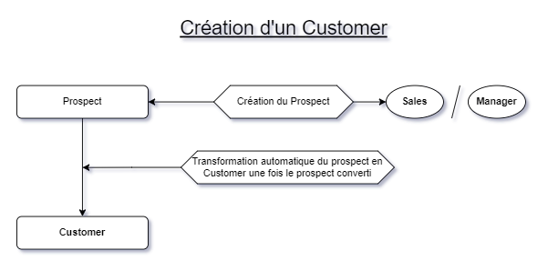
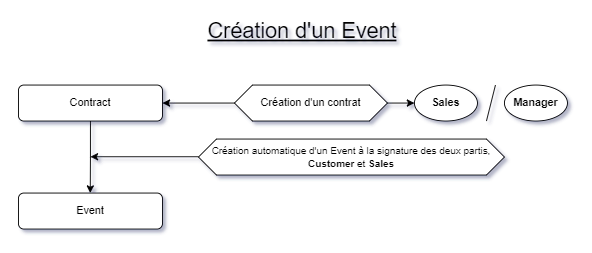

# EpicEvents - API CRM réservé à la gestion client et à l'organisation d'évènement. 

&nbsp;

# Lancement du projet

1. Tout d'abord, cloner le repository sur votre machine.  
2. Mettez en place un environnement virtuel (Avec notamment `virtual env`)
3. Installer les dépendances avec un `pip install -r requirements.txt`
4. Lancer le serveur avec un `python manage.py runserver`

&nbsp;

## Logique métier derrière la création d'un Customer ou d'un Event :

---

&nbsp;

&nbsp;

#  <ins>Gestion de projet :

&nbsp;

###  <ins>Authentification et gestion du compte :

&nbsp;

| Requête | Fonctions | Opérations CRUD |
| ----------- | ----------- | ----------- | 
| `login/` | Connexion | `POST` |
| `logout/` | Déconnexion | `GET` |
| `obtain-token/` | Renvois le token | `POST` |
| `create-employee/` | Création d'un employé (Manager uniquement) | `POST` |
| `password-update/` | Mise à jour du mot de passe | `PUT` |
| `home/account/` | Mise à jour des informations du compte | `GET`, `PUT` |
||||
||||

&nbsp;

###  <ins>CRM : 

&nbsp;

| Requête | Réponse | Customer | Sales | Support | Manager |
| ----------- | ----------- | ----------- | ----------- | ----------- | ----------- |
| `employee/` | Une liste de tous les employés affiliés ||||`GET`|
| `employee/<employee_id>` | Un employé ||||`GET`, `PUT`, `DELETE`|
| `customer/` | Une liste des clients affiliés ||`GET`|`GET`|`GET`|
| `customer/<customer_id>` | Un client ||`GET`|`GET`|`GET`, `PUT`, `DELETE`|
| `prospect/` | Une liste des prospects affiliés ||`GET`, `POST`||`GET`, `POST`|
| `prospect/<prospect_id>` | Un prospect ||`GET`, `PUT`||`GET`, `PUT`, `DELETE`|
| `free-prospect/` | Une liste des prospects non affectés ||||`GET`, `POST`|
| `free-prospect/<prospect_id>` | Une prospect non affecté ||||`GET`, `PUT`, `DELETE`|
| `provider/` | Une liste des fournisseurs ||`GET`|`GET`|`GET`, `POST`|
| `provider/<provider_id>` | Un fournisseur ||`GET`|`GET`|`GET`, `PUT`, `DELETE`|
| `contract/` | Une liste des contrats affiliés |`GET`|`GET`, `POST`|`GET`|`GET`, `POST`|
| `contract/<contract_id>` | Un contrat |`GET`, `PUT`|`GET`, `PUT`, `DELETE`|`GET`|`GET`, `PUT`, `DELETE`|
| `event/` | Une liste des évènements affiliés |`GET`|`GET`|`GET`|`GET`|
| `event/<event_id>` | Un contract |`GET`|`GET`|`GET`, `PUT`, `DELETE`|`GET`, `PUT`, `DELETE`|
| `free-event/` | Une liste des évènements non affectés ||||`GET`|
| `free-event/<event_id>` | Un évènement non affecté ||||`GET`, `PUT`, `DELETE`|
| `account/` | Les informations de l'utilisateur connecté |`GET`, `PUT`|`GET`, `PUT`|`GET`, `PUT`|`GET`, `PUT`|
||||
||||

> Tous les points d'entrée précèdant suppose en racine l'adresse `http://localhost:8000/home/`. &nbsp;

&nbsp;

##  <ins>Fonctionnement des affiliations

---

&nbsp;

| Requête | Customer | Sales | Support | Manager |
| ----------- | ----------- | ----------- | ----------- | ----------- | 
| `employee/` |  |  |  | Employee.manager |
| `prospect/` |  | Customer.sales_contact |  | Tout les Prospect rattachés aux Sales qu'il manage |
| `customer/` |  | Customer.sales_contact | Event.support_id | Tout les Customer rattachés aux Employee qu'il manage |
| `contract/` | Contract.customer_id | Contract.sales_contact | Tout les Contract rattachés aux Event qu'il gère  | Tout les Contract rattachés aux Sales qu'il manage |
| `event/` | Event.customer_id |  | Event.support_id |  Tout les Event rattachés aux Support qu'il manage  |
||||
||||

> Tous les points d'entrée précèdant suppose en racine l'adresse `http://localhost:8000/home/`. &nbsp;

> `Employee.manager` à la première ligne signifie : Tout les objects `Employee` ayant pour FK l'id du Manager à l'attribut `.manager`. La logique est la même pour les autres lignes abbrégées de la même manière.